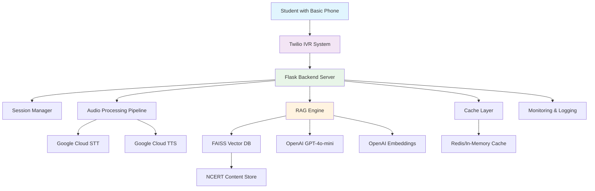

# VidyaVani AI-Powered IVR Learning System - Design Document

## Overview

VidyaVani is an AI-powered Interactive Voice Response (IVR) system that enables students in rural India to access NCERT Class 10 Science education through basic phone calls. The system combines Twilio IVR, OpenAI's GPT-4o-mini, Google Cloud Speech services, and a RAG (Retrieval-Augmented Generation) architecture to deliver personalized, multilingual educational content without requiring internet access from the student's end.

## Technology Stack Summary

| Layer | Technology | Version | Purpose |
|-------|-----------|---------|---------|
| **IVR Layer** | Twilio Programmable Voice | Latest | Call handling, DTMF, recording |
| **Backend** | Python + Flask | 3.9+ / 2.3+ | API orchestration |
| **STT** | Google Cloud Speech-to-Text | v1 | Voice to text conversion |
| **TTS** | Google Cloud Text-to-Speech | v1 | Text to voice conversion |
| **LLM** | OpenAI GPT-4o-mini | Latest | Answer generation |
| **Embeddings** | OpenAI Embeddings | text-embedding-3-small | Content vectorization |
| **Vector DB** | FAISS | 1.7+ | Semantic search |
| **Cache** | In-Memory (dict) / Redis | 7+ | Response & audio caching |
| **PDF Processing** | PyPDF2 / pdfplumber | Latest | NCERT content extraction |
| **Hosting** | Render.com / Railway.app | N/A | Cloud deployment |
| **Monitoring** | Python logging | 3.9+ | Performance tracking |

### Key Design Principles

- **Accessibility First**: Works on any basic mobile phone with DTMF keypad support
- **Performance Optimized**: Target 8-second response time through parallel processing and caching
- **Cost Efficient**: Designed to operate within free-tier API limits for hackathon prototype
- **Multilingual**: Native support for English and Telugu with graceful fallbacks
- **Educational Quality**: Responses grounded in official NCERT curriculum content

## Architecture

### High-Level System Architecture



### Component Architecture

The system follows a microservices-inspired modular design within a single Flask application for simplicity during the hackathon phase.

## Components and Interfaces

### 1. IVR Interface Layer

**Purpose**: Handles phone call interactions and menu navigation

**Key Components**:
- **Call Handler**: Processes incoming Twilio webhooks
- **Menu System**: Manages language selection and navigation flow
- **Audio Recorder**: Captures student voice input (15-second limit)
- **Response Player**: Delivers TTS audio responses

**Interface Specifications**:
```python
class IVRInterface:
    def handle_incoming_call(self, request) -> TwiMLResponse
    def process_language_selection(self, language_code: str) -> TwiMLResponse
    def record_question(self, session_id: str) -> TwiMLResponse
    def play_response(self, audio_url: str, session_id: str) -> TwiMLResponse
    def handle_menu_navigation(self, digit: str, session_id: str) -> TwiMLResponse
```

**Menu Flow Design**:
1. Welcome message → Language selection (1=English, 2=Telugu)
2. Grade confirmation → Subject confirmation (Class 10 Science)
3. Interaction mode → Browse topics (1) or Ask question (2)
4. Question recording → 15-second voice capture
5. Response delivery → Follow-up options (1=Detailed, 2=New question, 3=Menu)

### 2. Audio Processing Pipeline

**Purpose**: Converts between speech and text for multilingual support

**Components**:
- **STT Service**: Google Cloud Speech-to-Text with language detection
- **TTS Service**: Google Cloud Text-to-Speech with Indian voices
- **Audio Optimizer**: Handles codec conversion and quality optimization

**Interface Specifications**:
```python
class AudioProcessor:
    def speech_to_text(self, audio_data: bytes, language: str) -> str
    def text_to_speech(self, text: str, language: str, voice_type: str) -> bytes
    def optimize_audio_quality(self, audio_data: bytes) -> bytes
    def detect_language(self, audio_data: bytes) -> str
```

**Performance Optimizations**:
- Parallel STT processing while initializing content retrieval
- Audio streaming for faster TTS delivery
- Codec optimization for Twilio compatibility (PCMU/PCMA)
- Background noise filtering for rural environments

### 3. RAG Engine

**Purpose**: Retrieves relevant NCERT content and generates contextual responses

**Components**:
- **Content Retriever**: FAISS-based semantic search
- **Context Builder**: Assembles relevant content chunks
- **Response Generator**: OpenAI GPT-4o-mini integration
- **Answer Formatter**: Adapts responses for voice delivery

**Interface Specifications**:
```python
class RAGEngine:
    def retrieve_content(self, question: str, top_k: int = 3) -> List[ContentChunk]
    def build_context(self, question: str, content_chunks: List[ContentChunk]) -> str
    def generate_response(self, context: str, question: str, language: str, detail_level: str) -> str
    def format_for_voice(self, response: str, language: str) -> str
```

**Content Retrieval Strategy**:
1. Question embedding using OpenAI Embeddings API
2. FAISS similarity search in NCERT vector database
3. Top-3 content chunk retrieval with metadata filtering
4. Context assembly with chapter/topic information

**Response Generation Strategy**:
- **Simple Mode**: 50-75 words, direct answers
- **Detailed Mode**: 100-150 words, explanations with examples
- **Language-specific prompts**: Optimized for English/Telugu output
- **Grade-appropriate language**: Class 10 comprehension level

### 4. Content Management System

**Purpose**: Manages NCERT curriculum content and vectorization

**Components**:
- **Content Extractor**: PDF processing and text extraction
- **Content Structurer**: Chapter/topic organization
- **Vector Generator**: OpenAI Embeddings creation
- **Content Updater**: Version control and updates

**Content Structure**:
```json
{
  "content_id": "ncert_class10_physics_ch1_sec2",
  "chapter": "Light - Reflection and Refraction",
  "section": "Reflection of Light",
  "content": "When light falls on a surface, it bounces back...",
  "metadata": {
    "subject": "Physics",
    "grade": 10,
    "language": "English",
    "word_count": 287,
    "difficulty": "medium"
  },
  "embedding": [0.1, -0.2, 0.3, ...],
  "keywords": ["reflection", "mirror", "incident ray", "normal"]
}
```

**Content Processing Pipeline**:
1. NCERT PDF download and text extraction
2. Content chunking (200-300 words with overlap)
3. Metadata enrichment (chapter, topic, keywords)
4. Embedding generation using OpenAI Embeddings API
5. FAISS index creation and optimization

### 5. Session Management

**Purpose**: Maintains conversation context and user state

**Components**:
- **Session Store**: In-memory session data management
- **Context Tracker**: Question/answer history within calls
- **State Manager**: Current menu position and user preferences

**Session Data Structure**:
```python
@dataclass
class UserSession:
    session_id: str
    phone_number: str
    language: str
    current_menu: str
    question_history: List[str]
    response_history: List[str]
    start_time: datetime
    last_activity: datetime
    performance_metrics: Dict[str, float]
```

### 6. Caching and Performance Layer

**Purpose**: Optimizes response times and reduces API costs

**Caching Strategy**:
- **L1 Cache**: In-memory Python dictionaries for session data
- **L2 Cache**: Redis for common questions and TTS audio
- **L3 Cache**: Pre-generated responses for top 50 questions

**Cache Structure**:
```python
class CacheManager:
    def get_cached_response(self, question_hash: str, language: str) -> Optional[str]
    def cache_response(self, question_hash: str, response: str, language: str, ttl: int)
    def get_cached_audio(self, text_hash: str, language: str) -> Optional[bytes]
    def cache_audio(self, text_hash: str, audio_data: bytes, language: str, ttl: int)
    def preload_common_responses(self) -> None
```

## Data Models

### Core Data Structures

**Content Chunk Model**:
```python
@dataclass
class ContentChunk:
    id: str
    chapter_name: str
    section_name: str
    content_text: str
    subject: str  # Physics, Chemistry, Biology
    grade: int
    language: str
    embedding: np.ndarray
    metadata: Dict[str, Any]
    created_at: datetime
    updated_at: datetime
```

**Question-Answer Model**:
```python
@dataclass
class QuestionAnswer:
    question_id: str
    session_id: str
    original_question: str
    processed_question: str
    retrieved_content: List[ContentChunk]
    generated_response: str
    language: str
    detail_level: str  # simple, detailed
    response_time: float
    timestamp: datetime
```

**Performance Metrics Model**:
```python
@dataclass
class PerformanceMetrics:
    session_id: str
    stt_time: float
    retrieval_time: float
    generation_time: float
    tts_time: float
    total_time: float
    api_calls_count: Dict[str, int]
    cache_hit_rate: float
    timestamp: datetime
```

### Database Schema

**FAISS Vector Database**:
- **Index Type**: IndexFlatIP (Inner Product for cosine similarity)
- **Dimension**: 1536 (OpenAI Embeddings dimension)
- **Metadata Storage**: Separate JSON files mapped by content IDs

**Session Storage** (In-Memory/Redis):
- **Key Pattern**: `session:{phone_number}:{timestamp}`
- **TTL**: 1 hour (automatic cleanup)
- **Data Format**: JSON serialized session objects

## Error Handling

### Error Categories and Strategies

**1. API Service Failures**:
- **STT Failures**: Retry with exponential backoff (3 attempts), fallback to "Please repeat your question"
- **OpenAI Failures**: Use cached responses if available, otherwise provide generic educational guidance
- **TTS Failures**: Retry with different voice, fallback to text display in web backup demo

**2. Audio Quality Issues**:
- **Poor Audio Quality**: Request repetition with clearer speech instructions
- **Background Noise**: Apply noise filtering, request quieter environment
- **Unclear Speech**: Offer menu-based topic browsing as alternative

**3. Content Retrieval Issues**:
- **No Relevant Content**: Acknowledge limitation, suggest related topics from curriculum
- **Ambiguous Questions**: Ask clarifying questions or provide multiple topic options
- **Out-of-Scope Questions**: Politely redirect to Class 10 Science topics

**4. System Performance Issues**:
- **High Latency**: Implement circuit breakers, use cached responses
- **Memory Issues**: Implement session cleanup, limit concurrent users
- **API Rate Limits**: Queue requests, provide estimated wait times

### Error Response Templates

```python
ERROR_RESPONSES = {
    "stt_failed": {
        "english": "I couldn't understand your question clearly. Please speak slowly and try again.",
        "telugu": "మీ ప్రశ్న స్పష్టంగా వినిపించలేదు. దయచేసి నెమ్మదిగా మాట్లాడి మళ్లీ ప్రయత్నించండి."
    },
    "content_not_found": {
        "english": "I don't have information about that topic in Class 10 Science. Would you like to ask about Physics, Chemistry, or Biology?",
        "telugu": "క్లాస్ 10 సైన్స్‌లో ఆ విషయం గురించి నాకు సమాచారం లేదు. భౌతిక శాస్త్రం, రసాయన శాస్త్రం లేదా జీవ శాస్త్రం గురించి అడగాలనుకుంటున్నారా?"
    }
}
```

## Testing Strategy

### Testing Pyramid Approach

**1. Unit Tests (40% of testing effort)**:
- **Audio Processing**: STT/TTS conversion accuracy
- **RAG Engine**: Content retrieval and response generation
- **Session Management**: State transitions and data persistence
- **Caching**: Cache hit/miss scenarios and TTL behavior

**2. Integration Tests (35% of testing effort)**:
- **API Integration**: Twilio, OpenAI, Google Cloud services
- **End-to-End Flows**: Complete call scenarios with mocked external services
- **Error Handling**: Failure scenarios and recovery mechanisms
- **Performance**: Response time measurements under load

**3. System Tests (25% of testing effort)**:
- **Live Phone Testing**: Actual calls with different phone types
- **Multilingual Testing**: English and Telugu conversation flows
- **Concurrent User Testing**: 5+ simultaneous calls
- **Demo Preparation**: 20 curated questions with verified responses

### Test Data and Scenarios

**Test Question Categories**:
1. **Physics**: Light reflection, electricity, magnetic effects (5 questions each)
2. **Chemistry**: Chemical reactions, acids/bases, metals (5 questions each)
3. **Biology**: Life processes, reproduction, heredity (5 questions each)
4. **Edge Cases**: Unclear audio, off-topic questions, very long questions

**Performance Benchmarks**:
- **STT Processing**: < 2 seconds for 15-second audio
- **Content Retrieval**: < 1 second for semantic search
- **OpenAI Response**: < 3 seconds for 100-word response
- **TTS Generation**: < 2 seconds for 100-word audio
- **Total Round-trip**: < 8 seconds average, < 12 seconds maximum

### Automated Testing Pipeline

```python
class TestSuite:
    def test_audio_processing_accuracy(self):
        # Test STT accuracy with sample audio files
        pass
    
    def test_rag_content_retrieval(self):
        # Test semantic search with known questions
        pass
    
    def test_response_generation_quality(self):
        # Test OpenAI responses for educational appropriateness
        pass
    
    def test_multilingual_support(self):
        # Test English/Telugu processing and responses
        pass
    
    def test_performance_benchmarks(self):
        # Measure component response times
        pass
    
    def test_error_handling_scenarios(self):
        # Test graceful failure and recovery
        pass
```

## API Endpoints Specification

### Twilio Webhook Endpoints

**POST /webhook/incoming-call**
- **Purpose**: Handle incoming call initiation
- **Request**: Twilio webhook payload
- **Response**: TwiML with welcome message and language selection
- **Expected Response Time**: < 500ms

**POST /webhook/language-selection**
- **Purpose**: Process DTMF language selection
- **Parameters**: `Digits` (1=English, 2=Telugu)
- **Response**: TwiML with grade confirmation
- **Expected Response Time**: < 200ms

**POST /webhook/record-question**
- **Purpose**: Receive and process recorded question audio
- **Parameters**: `RecordingUrl`, `SessionId`, `Language`
- **Response**: TwiML to play "Processing..." message
- **Triggers**: Async question processing pipeline
- **Expected Response Time**: < 300ms (acknowledgment only)

**POST /webhook/deliver-response**
- **Purpose**: Play generated answer audio
- **Parameters**: `ResponseAudioUrl`, `SessionId`
- **Response**: TwiML with follow-up menu options
- **Expected Response Time**: < 200ms

### Internal API Endpoints

**POST /api/process-question**
- **Purpose**: Internal async question processing
- **Request Body**: `{"session_id": "string", "audio_url": "string", "language": "english|telugu"}`
- **Response**: 202 Accepted (async processing)
- **Processing Steps**: STT → RAG → TTS → Cache
- **Expected Total Time**: < 8 seconds

**GET /api/health**
- **Purpose**: Health check for monitoring
- **Response**: System status and component availability
- **Expected Response Time**: < 100ms

**GET /api/metrics**
- **Purpose**: Performance metrics dashboard
- **Response**: JSON with performance statistics
- **Expected Response Time**: < 500ms

## Performance Requirements Summary

| Metric | Target | Maximum | Measurement Point |
|--------|--------|---------|-------------------|
| **STT Processing** | < 2s | 3s | Audio end to text output |
| **Content Retrieval** | < 1s | 1.5s | Query to FAISS results |
| **OpenAI Generation** | < 3s | 5s | Request to response |
| **TTS Generation** | < 2s | 3s | Text to audio output |
| **Total Response Time** | < 8s | 12s | Question end to answer start |
| **Cache Hit Rate** | > 40% | N/A | Common questions |
| **Concurrent Users** | 5 | 10 | Without degradation |
| **System Uptime** | 95% | N/A | During demo hours |
| **API Success Rate** | > 95% | N/A | Non-timeout responses |

## Performance Optimization Strategies

### 1. Parallel Processing Architecture

**Concurrent Operations**:
- STT processing + Content retrieval initialization
- Response generation + TTS preparation
- Audio streaming + Next question preparation

**Implementation**:
```python
import asyncio
from concurrent.futures import ThreadPoolExecutor

async def process_question_parallel(audio_data, session):
    # Start STT and content prep simultaneously
    stt_task = asyncio.create_task(speech_to_text(audio_data))
    prep_task = asyncio.create_task(prepare_content_retrieval())
    
    question_text = await stt_task
    retrieval_ready = await prep_task
    
    # Continue with RAG processing
    response = await generate_response(question_text)
    return response
```

### 2. Multi-Level Caching Strategy

**Cache Hierarchy**:
1. **Session Cache**: Current conversation context (in-memory)
2. **Response Cache**: Common question-answer pairs (Redis, 1-hour TTL)
3. **Audio Cache**: Pre-generated TTS for frequent responses (Redis, 24-hour TTL)
4. **Content Cache**: FAISS index and embeddings (persistent)

**Cache Warming**:
- Pre-generate top 50 common questions during system startup
- Background TTS generation for cached responses
- Periodic cache refresh based on usage patterns

### 3. API Optimization

**OpenAI Optimization**:
- **Model**: GPT-4o-mini (faster, cost-effective)
- **Max Tokens**: 150 (optimal for voice delivery)
- **Temperature**: 0.3 (consistent, focused responses)
- **Streaming**: Enable response streaming for faster TTS start

**Google Cloud Optimization**:
- **STT**: Enhanced model for Indian English, noise robustness
- **TTS**: Indian English and Telugu voices, optimal speaking rate
- **Audio Format**: 16kHz, 16-bit for quality-performance balance

### 4. Resource Management

**Memory Management**:
- Session cleanup after 1-hour inactivity
- FAISS index optimization for memory efficiency
- Garbage collection tuning for Python runtime

**Connection Pooling**:
- HTTP connection reuse for API calls
- Database connection pooling for metadata storage
- WebSocket connections for real-time monitoring

## Security and Privacy Design

### Data Protection Measures

**1. Minimal Data Collection**:
- No personal identification required
- Phone numbers used only for session management
- Voice recordings processed and immediately discarded

**2. Secure API Communication**:
- HTTPS for all external API calls
- API keys stored in environment variables
- Request/response logging without sensitive data

**3. Session Security**:
- Session tokens with 1-hour expiration
- No persistent user data storage
- Automatic session cleanup

### Privacy Compliance

**Data Handling Policy**:
```python
class PrivacyManager:
    def process_audio(self, audio_data: bytes) -> str:
        # Process audio to text
        text = self.stt_service.convert(audio_data)
        
        # Immediately delete audio data
        del audio_data
        
        return text
    
    def log_interaction(self, session_id: str, question: str, response: str):
        # Log without personal identifiers
        log_entry = {
            "session_hash": hashlib.sha256(session_id.encode()).hexdigest()[:8],
            "question_category": self.categorize_question(question),
            "response_length": len(response),
            "timestamp": datetime.utcnow()
        }
        self.logger.info(log_entry)
```

## Deployment Architecture

### Infrastructure Components

**1. Application Server**:
- **Platform**: Render.com or Railway.app (free tier)
- **Runtime**: Python 3.9+ with Flask
- **Memory**: 512MB (sufficient for prototype)
- **Storage**: 1GB for NCERT content and FAISS index

**2. External Services**:
- **Twilio**: IVR and voice services (trial account)
- **OpenAI**: GPT-4o-mini and Embeddings API (free tier)
- **Google Cloud**: Speech-to-Text and Text-to-Speech (free tier)

**3. Monitoring and Logging**:
- **Application Logs**: Structured JSON logging
- **Performance Metrics**: Response time tracking
- **Error Monitoring**: Exception tracking and alerting

### Deployment Pipeline

```yaml
# deployment.yml
name: VidyaVani Deployment
on:
  push:
    branches: [main]

jobs:
  deploy:
    runs-on: ubuntu-latest
    steps:
      - uses: actions/checkout@v2
      - name: Setup Python
        uses: actions/setup-python@v2
        with:
          python-version: '3.9'
      - name: Install dependencies
        run: pip install -r requirements.txt
      - name: Run tests
        run: python -m pytest tests/
      - name: Deploy to Render
        run: |
          # Automated deployment to Render.com
          curl -X POST $RENDER_DEPLOY_HOOK
```

### Environment Configuration

```python
# config.py
import os
from dataclasses import dataclass

@dataclass
class Config:
    # Twilio Configuration
    TWILIO_ACCOUNT_SID: str = os.getenv('TWILIO_ACCOUNT_SID')
    TWILIO_AUTH_TOKEN: str = os.getenv('TWILIO_AUTH_TOKEN')
    TWILIO_PHONE_NUMBER: str = os.getenv('TWILIO_PHONE_NUMBER')
    
    # OpenAI Configuration
    OPENAI_API_KEY: str = os.getenv('OPENAI_API_KEY')
    OPENAI_MODEL: str = 'gpt-4o-mini'
    OPENAI_MAX_TOKENS: int = 150
    
    # Google Cloud Configuration
    GOOGLE_CLOUD_PROJECT: str = os.getenv('GOOGLE_CLOUD_PROJECT')
    GOOGLE_APPLICATION_CREDENTIALS: str = os.getenv('GOOGLE_APPLICATION_CREDENTIALS')
    
    # Performance Configuration
    MAX_CONCURRENT_CALLS: int = 5
    RESPONSE_TIMEOUT: int = 8
    CACHE_TTL: int = 3600
```

This comprehensive design provides a solid foundation for implementing the VidyaVani system within the hackathon timeframe while maintaining scalability and educational quality standards.
##
 Requirements Traceability

| Requirement | Design Components | Implementation Notes |
|-------------|------------------|---------------------|
| **Req 1**: Phone-based access | IVR Interface, Twilio Integration | DTMF menu navigation |
| **Req 2**: NCERT accuracy | RAG Engine, Content Management | 90% accuracy target |
| **Req 3**: Telugu support | Audio Processing, TTS Service | Google Cloud multilingual APIs |
| **Req 4**: Detailed explanations | RAG Engine (detail_level parameter) | Simple vs detailed modes |
| **Req 5**: Fast responses | Performance Layer, Caching | < 8s target |
| **Req 6**: Basic phone support | IVR Interface (DTMF only) | No smartphone required |
| **Req 7**: Monitoring | Monitoring & Logging component | Performance metrics tracking |
| **Req 8**: Security | Security & Privacy Design | No PII storage |
| **Req 9**: Free-tier operation | Cache Layer, Rate Limiting | Cost optimization |
| **Req 10**: Error handling | Error Handling strategies | Retry logic, fallbacks |
| **Req 11**: API integration | All external service integrations | Twilio, OpenAI, Google |
| **Req 12**: Content management | Content Management System | NCERT PDF processing |
| **Req 13**: Deployment | Deployment Architecture | Render/Railway hosting |
| **Req 14**: Testing | Testing Strategy | 20-question test set |
| **Req 15**: Demo | Cached responses, backup system | Web simulator backup |